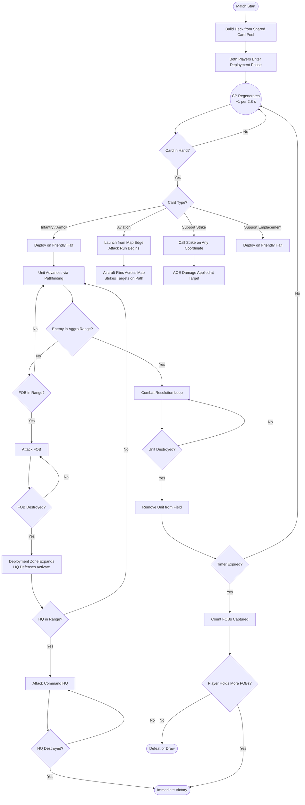
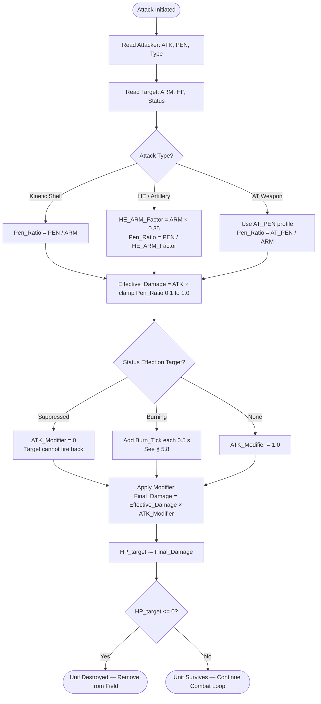

# Game Design Document: Tank Royale

## 1. Game Overview

**Project Name:** Tank Royale

**Genre:** Real-Time Strategy (RTS) / Card Battler

**Platforms:** PC (Desktop) and Mobile, local multiplayer support

**Target Audience:** Casual and mid-core players who enjoy fast-paced PvP strategy with stylized combined-arms gameplay.

**Core Concept:** Players choose a side — **Allies** or **Axis** — and assemble an 8-card deck from historically-inspired WW2/Cold War tanks belonging to their faction. During a fast-paced 3-minute match, players spend a regenerating resource ("Command Points") to deploy units onto a dual-front battlefield. Units act autonomously, advancing toward the enemy's Forward Operating Bases (FOBs) and ultimately their Command HQ. The game ends with the destruction of an enemy HQ or by holding more FOBs when the timer runs out.

**Factions:**
- **Allies** — USA, USSR, Great Britain, France + Sweden (neutral)
- **Axis** — Germany, Japan, Italy + Sweden (neutral)

Players choose their faction before deck-building and may only select tanks from that faction. Swedish tanks are a neutral pool available to either side. Players may freely mix nations within their faction (e.g. combine Soviet and American tanks in one Allies deck).

---

## 2. Core Gameplay Mechanics

### The Battlefield

- **Orientation:** Landscape. **Player 1 (blue)** deploys from the **left (−X) side**; **Player 2 / AI (red)** deploys from the **right (+X) side**. The two lanes run along the **Z axis** (north and south).
- **Layout:** A symmetrical top-down war map split into two halves (Friendly Half / Enemy Half) separated by a contested no-man's-land at X = 0.
- **Terrain:** Roads (faster movement), open ground (standard), rubble/craters and mud (reduced speed). Terrain is fixed per map. *Implemented* via `TerrainModifierZone` trigger volumes that scale unit `MOV` by a `TerrainTypeSO` multiplier (Road ×1.3, Open ×1.0, Rubble ×0.6, Mud ×0.4 — Mud also serves as the "Bogged Down" terrain of §5.7).
- **River:** A river channel runs down the **centre line (X = 0)** from map edge to map edge. It is **impassable except at the two bridges** (one per lane at Z = ±12). The bridges are the only crossing points and create natural chokepoints.
- **Bridges:** Two wooden bridges crossing the river, each 5 units wide — wide enough for one tank at a time. Tactically significant: a single heavy tank can hold a bridge against multiple light tanks.
- **Fronts:** Two "fronts" (north lane Z ≈ +12, south lane Z ≈ −12) cross no-man's-land via the bridges, creating two distinct avenues of attack.
- **Structures:** Each player commands 3 structures:
  - **2 Forward Operating Bases (FOBs):** One per front. They have auto-firing defensive weapons (crew-served guns, AA batteries). These are military positions, not fantasy towers.
  - **1 Command HQ:** Placed behind the FOBs at ±25 X. It is hardened and fully activates its perimeter defenses only after a FOB falls or takes direct fire.
- **Win Conditions:**
  - Destroying the enemy Command HQ: immediate victory.
  - Timer expiry: the player who controls (has destroyed) more enemy FOBs wins.
  - Tiebreaker: total enemy unit casualties.

### Resource System (Command Points)

- **Starting CP:** Matches begin with **8 CP**, guaranteeing at least one affordable opener with any legal deck (max card cost is 9).
- **Generation:** Command Points (CP) regenerate passively at a rate of 1 CP per 2.8 seconds. Each CP gained plays a soft chime.
- **Surge Phase:** In the final 60 seconds, CP generation doubles, forcing decisive action.
- **Capacity:** CP bar caps at 10. When full, generation pauses — spend CP to keep the pressure on.
- **Usage:** Deploying a card costs its listed CP value (ranging from 2 to 9).

### AI and Pathfinding

- Once deployed, units act autonomously — the player has no direct control.
- **Pathfinding:** All ground units use Unity NavMesh for obstacle-aware navigation. Rocks, trees, and compound walls are baked as impassable; tanks are dynamic obstacles handled by NavMesh local avoidance (RVO).
- **Targeting Priority:** Tanks engage enemy tanks first. Only when all enemy tanks are eliminated do they advance on enemy FOBs (nearest first) and then the Command HQ.
- **Anti-Air Awareness:** Aircraft can be targeted and shot down by units or FOBs with the **AA Capable** keyword.

#### Four-State AI Loop (implemented)

Each tank runs a four-state state machine every Update frame:

| State | Behaviour |
|---|---|
| **Search** | Polls every 0.5 s for the nearest visible enemy tank within detection cone + line-of-sight. If no tanks visible, searches for nearest enemy FOB/HQ (objectives always globally known — no LOS required). Transitions → Priority. |
| **Priority** | Re-evaluates globally. Rule 1: any visible enemy tank → target it, roll approach style, go to Pathfind. Rule 2: no tanks anywhere → target nearest enemy objective, go to Pathfind. |
| **Pathfind** | Two-phase navigation for unit targets. **Phase 1 (Staging):** navigates to a staging position anchored to the *target's own facing direction* — WideFlank stages at ~131° off the target's forward (rear quarter); ShallowFlank stages at 90° (side); Direct skips staging. **Phase 2:** once at the staging position, closes straight in to attack range. For objectives: navigates to the closest NavMesh-reachable point near the structure. Transitions → Attack when within weapon RNG. |
| **Attack** | Stops, faces target, fires every `1/SPD` seconds. For unit targets: validates detection cone each tick (drop lock if target exits cone AND beyond `RNG × 1.5`). If target backs outside `RNG × 1.2`, returns to Pathfind. If target dies or is destroyed, immediately returns to Search (scan timer reset to 0 for instant response). |

#### Line-of-Sight Detection

Unit-vs-unit detection requires a clear line of sight through cover. A ray is cast from the detecting tank to the target; if it hits any solid collider that is not a tank or objective structure, detection fails. This means:

- **Rocks and trees block detection** — a fast flanker can use cover to approach a heavy tank undetected.
- **Walls block detection** — tanks inside compounds are invisible to tanks outside until line-of-sight clears.
- **Objectives are exempt** — FOBs and HQs are always globally visible to all surviving tanks (their positions are fixed and known).

The detection cone (§2.1) is applied first; LOS is only checked for targets already within the forward arc.

### 2.1 AI Tactical Profiles

Each tank type has a **tactical personality** that governs how it approaches an enemy. Whenever a unit acquires a new target, it rolls a randomized **Approach Style** from three options weighted per tank type. The side (left vs right) is also randomized to prevent mirrored, predictable patterns.

#### Approach Styles

| Style | Description |
|---|---|
| **Direct** | Charges straight to just inside attack range. Front-arc armour exchange. |
| **Shallow Flank** | Stages at 90° off the *target's own* right or left, then closes in. Attacks from the side arc (ARM ×0.40, ATK ×1.5). |
| **Wide Flank** | Stages at ~131° off the *target's own* forward (rear quarter), routing around the target via NavMesh. Attacks from rear arc (ARM ×0.15, ATK ×2.5). The staging position is computed from the **target's facing**, not the attacker's approach vector, so it stays anchored to the target's rear regardless of relative movement. |

> **RocketArtillery** (RocketShip) always holds position at maximum range regardless of roll — flanking provides no benefit for indirect fire.

#### Detection Cone

Units with a `detectionAngle` less than 360° can only scan for and track enemies within a forward-facing cone. Enemies that move outside the cone are lost as targets (unless within close-combat range ≤ 1.5× RNG, where contact is maintained regardless).

While engaged, tanks slowly rotate their facing toward the locked target. A fast flanker can outpace a slow-rotating heavy tank and exit its detection cone, causing the heavy to lose the lock and stand idle while the flanker approaches from the side or rear.

| Tank | Detection Angle | Turn Speed | Notes |
|---|---|---|---|
| **Heavy** | 110° | 0.9 | Tight cone + very slow rotation — light flankers can out-rotate it |
| **Monster** | 360° | 1.0 | Ponderous |
| **MegaBall** | 360° | 1.2 | Heavy charger |
| **Original** | 360° | 3.0 | Baseline |
| **Alternative** | 360° | 2.8 | — |
| **Droid** | 360° | 3.0 | — |
| **Shark** | 360° | 3.5 | — |
| **Spike** | 360° | 3.2 | — |
| **RocketShip** | 360° | 2.5 | — |
| **UFO** | 360° | 4.0 | — |
| **Light** | 360° | 5.0 | Fast flanker; out-rotates heavy tracking |
| **UTV** | 360° | 5.5 | Scout; quickest rotation |

Turn Speed is a slerp factor (degrees/frame-weighted). Higher = faster rotation toward a locked target during Attack state.

#### Per-Tank Approach Weights

Weights are relative probabilities; the engine normalizes them. A weight of 0 means the style never occurs.

| Tank | Direct | Shallow Flank | Wide Flank | Personality |
|---|---|---|---|---|
| **Original** | 0.50 | 0.35 | 0.15 | Balanced all-rounder; mostly charges with occasional probing flanks |
| **Alternative** | 0.50 | 0.35 | 0.15 | Disciplined; high PEN rewards direct engagements |
| **Light** | 0.10 | 0.45 | 0.45 | Erratic flanker; almost never charges straight due to low ARM |
| **Heavy** | 0.75 | 0.20 | 0.05 | Front-line brawler; ARM and HP reward trading shots head-on |
| **Monster** | 0.80 | 0.15 | 0.05 | Devastating frontal assault; ATK too high to waste on side approaches |
| **Spike** | 0.15 | 0.50 | 0.35 | Armor Piercer; prefers side/rear arcs where ArmorPierceIgnore stacks even further |
| **Shark** | 0.70 | 0.25 | 0.05 | Aggressive; charges to join allies already engaging a target for the ATK bonus |
| **Droid** | 0.50 | 0.35 | 0.15 | Methodical; self-repair means it can absorb hits from any angle |
| **UTV** | 0.10 | 0.35 | 0.55 | Scout; exploits mobility with wide sweeping routes |
| **MegaBall** | 0.75 | 0.20 | 0.05 | Rollout charger; designed to breach head-on |
| **RocketShip** | — | — | — | Always hangs back at max range (RocketArtillery keyword overrides roll) |
| **UFO** | 0.20 | 0.30 | 0.50 | Hover; exploits terrain-ignoring movement with wide flanking arcs |

---

## 3. Control Schemes

The game supports two control schemes for PC and Mobile parity.

### Touchscreen Controls (Mobile/Tablet)

- **Drag-and-Drop:** Press and hold a card in the hand, drag it over the friendly deployment zone, and release to deploy.
- **Tap-to-Deploy:** Tap a card to select it, then tap a valid tile to deploy.
- **Deselect:** Tap elsewhere or tap another card to cancel.

### Keyboard and Mouse Controls (PC)

- **Drag-and-Drop:** Left-click-hold a card, drag to the battlefield, release to deploy. A ghost preview follows the cursor (green = valid, red = invalid) and the green deploy-zone overlay shows while dragging.
- *(Hotkeys 1–4 were removed — deployment is drag-only by design.)*
- **Deck builder:** Left-click a card opens its detail panel; **Right-click** adds/removes it from the deck.

---

## 4. Card Types and Deployment

Players bring a deck of 8 cards into battle. The hand holds 4 cards at a time. When a card is played, the next card from the deck rotation enters the hand.

### Card Types

1. **Infantry:** Squads of foot soldiers. Cheap, numerous, effective against other infantry and light vehicles. Vulnerable to tanks and artillery. Deployed on friendly ground.
2. **Armor (Tanks):** The backbone of the deck. Durable, high-damage, effective against FOBs and other vehicles. Core card type of the game. Deployed on friendly ground.
3. **Aviation:** Aircraft and helicopter gunships. Very expensive, extremely powerful, fly over terrain and engage ground targets across the entire width of the map. Cannot be deployed on the ground — they enter from the map edge and execute a single attack run before exiting. Can be shot down by AA-capable units mid-run.
4. **Support:** Limited-use deployable assets — artillery strikes, smoke screens, supply drops, defensive emplacements. Deployed on the friendly half (emplacements) or called anywhere (strikes).

### Deployment Rules

- Infantry and Armor deploy on the player's half only.
- Destroying an enemy FOB expands the valid deployment zone into the enemy's corresponding front.
- Aviation cards launch from the player's edge and fly the full map length; they cannot be dropped at a specific point.
- Support Strikes can be called on any map coordinate; Support Emplacements deploy on the friendly half only.

---

## 5. Damage Calculation System

All combat values use the following formulae. The core addition over a generic system is the **Armor / Penetration** mechanic, which creates rock-paper-scissors dynamics between unit classes.

### Core Stats

| Stat  | Description                                 |
| ----- | ------------------------------------------- |
| `HP`  | Hit Points                                  |
| `ATK` | Base damage per shot/attack                 |
| `ARM` | Armor rating — resistance to kinetic damage |
| `PEN` | Penetration — ability to defeat armor       |
| `SPD` | Attack speed (shots per second)             |
| `MOV` | Movement speed (tiles per second)           |
| `RNG` | Attack range (tiles)                        |

---

### 5.0 Directional Armor (Arc System)

All tank damage is modified by which arc the attacker fires from, relative to the **defender's** facing direction.

| Arc | Angle from Defender's Forward | ARM Multiplier | ATK Multiplier |
|---|---|---|---|
| **Front** | < 45° | ×1.00 (full armor) | ×1.0 |
| **Sides** | 45°–135° | ×0.40 (60% stripped) | ×1.5 |
| **Rear** | > 135° | ×0.15 (85% stripped) | ×2.5 |

Both multipliers apply simultaneously. A rear hit against a Heavy tank (ARM 90):

```
Effective_ARM = 90 × 0.15 = 13.5
PEN_Ratio     = Light_PEN(80) / 13.5 = 5.9 → clamped to 1.0
Base_Damage   = Light_ATK(200) × 1.0 = 200
Final_Damage  = 200 × 2.5 (rear ATK multiplier) = 500
```

vs a frontal hit:

```
Effective_ARM = 90 × 1.0 = 90
PEN_Ratio     = 80 / 90 = 0.89
Base_Damage   = 200 × 0.89 = 178
Final_Damage  = 178 × 1.0 = 178
```

This makes flanking and the tactical approach styles (GDD §2.1) mechanically meaningful.

---

### 5.1 Armor Penetration — Core Damage Formula

When a unit fires, its shell's penetration is compared to the target's armor. Full damage is dealt only on a clean penetration.

```
Pen_Ratio = PEN_attacker / ARM_target

If Pen_Ratio >= 1.0:
    Effective_Damage = ATK                         -- Full penetration
Else:
    Effective_Damage = ATK × Pen_Ratio             -- Partial / ricochet
```

> Minimum Effective_Damage is always 10% of ATK regardless of Pen_Ratio — even a glancing blow does superficial damage.

```
Effective_Damage = max(ATK × 0.1, ATK × clamp(Pen_Ratio, 0.1, 1.0))
```

> Example: Warden (ATK 350, PEN 80) vs Enforcer (ARM 65).
> Pen_Ratio = 80/65 = 1.23 → Full penetration → Effective_Damage = 350.

> Example: Scout (ATK 120, PEN 30) vs Warden (ARM 80).
> Pen_Ratio = 30/80 = 0.375 → Partial → Effective_Damage = 120 × 0.375 = 45.

---

### 5.2 Damage Per Second (DPS)

```
DPS = Effective_Damage × SPD
```

---

### 5.3 Time to Kill (TTK)

```
TTK = HP_target / DPS
```

Used internally by the AI threat-prioritization system. The unit with the lowest TTK against the firing unit is the preferred target.

---

### 5.4 Artillery / AOE Strike Damage

Artillery and strike cards deal HE (High Explosive) damage, which uses a reduced ARM modifier because HE damages through overpressure, not penetration.

```
HE_ARM_Factor = ARM_target × 0.35          -- HE only partially defeated by armor
HE_Pen_Ratio  = PEN_strike / HE_ARM_Factor
Effective_HE  = max(ATK × 0.3, ATK × clamp(HE_Pen_Ratio, 0.3, 1.0))
```

For **Falloff** strikes (blast radius), damage scales from full at the epicenter to 40% at the edge:

```
Falloff_Damage = Effective_HE × max(0.4, 1 − (Distance / Radius) × 0.6)
```

---

### 5.5 Aircraft Attack Run

Aircraft fire on targets along their flight path. They carry HE bombs and/or autocannon bursts.

- **Bombs:** Use §5.4 HE formula with a large Falloff radius.
- **Autocannon (e.g., Heavy Gunship autocannon):** Uses §5.1 with a high dedicated PEN value that simulates armor-piercing rounds.

```
-- Autocannon (depleted uranium / HEAT rounds)
Autocannon_Damage = ATK × clamp(PEN_gun / ARM_target, 0.3, 1.0)
```

Aircraft can be **shot down** mid-run. If an AA-capable unit or FOB deals enough damage before the aircraft completes its run, it is destroyed and its remaining attacks are cancelled.

```
Aircraft_HP_Remaining -= AA_Damage_per_tick × Time_in_Range
If Aircraft_HP_Remaining <= 0: Attack run cancelled
```

---

### 5.6 FOB Targeting & Defense Fire

FOBs fire at the nearest enemy unit in range. FOBs have their own ARM rating (hardened position) but their defensive weapons deal HE-type damage (§5.4).

```
FOB_DPS = FOB_ATK × FOB_SPD × clamp(FOB_PEN / Target_ARM × 0.35, 0.3, 1.0)
```

---

### 5.7 Status Effects

| Effect          | ATK Modifier | MOV Modifier | Duration    | Source                         |
| --------------- | ------------ | ------------ | ----------- | ------------------------------ |
| **Suppressed**  | `× 0`        | `× 0.3`      | 4 s         | Smoke Screen, nearby explosion |
| **Burning**     | +Burn DoT    | `× 0.5`      | 6 s         | Napalm Strike, Flamethrower    |
| **Bogged Down** | —            | `× 0.4`      | Until clear | Minefield, Mud Terrain         |

```
Buffed_Effective_Damage = Effective_Damage × ATK_Modifier
```

Suppression does not deal damage but prevents the target from returning fire, making it ideal for advancing infantry or covering a tank push.

---

### 5.8 Burning / Napalm Damage-over-Time

Burn damage is applied in ticks every 0.5 s with linear decay:

```
Burn_Tick(n) = BurnBase × (1 − (n / TotalTicks) × 0.5)
```

Default: `TotalTicks = 12` (6 seconds), `BurnBase = 40`.
Total burn damage ≈ `BurnBase × TotalTicks × 0.75` = `360` per application.
Burn ignores ARM entirely (thermal damage).

---

### 5.9 Strafing Ramp (Heavy Gunship Autocannon)

When an aircraft with the **Strafing** keyword locks onto a column of targets, each additional target hit in the same run receives a stacking damage bonus:

```
Strafe_Damage(n) = Base_ATK × min(2.0, 1.0 + n × 0.25)
```

Where `n` = number of targets already hit in the current run. Bonus resets at the start of each deployment.

---

### 5.10 Infantry AT Weapons (Anti-Tank Keyword)

Infantry squads with the **AT** keyword carry dedicated anti-tank weapons (bazookas, RPGs, ATGMs). Their AT shot uses a separate high-PEN profile:

```
AT_Effective_Damage = AT_ATK × clamp(AT_PEN / ARM_target, 0.2, 1.0)
```

Infantry AT shots fire at a lower SPD than their normal rifle fire. Only one AT shot fires per squad engagement.

---

## 6. Game Flow

### 6.1 Match Flow



### 6.2 Combat Resolution



---

## 7. Card Roster

Players choose a faction (Allies or Axis) before deck-building. They then assemble an 8-card deck freely from all tanks belonging to their faction (nations may be mixed). Swedish tanks are neutral and available to either faction.

### Stat Key

| Column | Meaning |
|---|---|
| CP | Command Points to deploy |
| HP | Hit points |
| ATK | Base damage per shot (kinetic or HE) |
| ARM | Effective frontal armour (mm) |
| PEN | Gun penetration at 100 m (mm) |
| SPD | Shots/sec (1 ÷ reload time) |
| MOV | Movement speed (tiles/sec) |
| RNG | Attack range (tiles) |

---

## 7.1 Faction System

- **Allies**: USA · USSR · Great Britain · France + Sweden (neutral)
- **Axis**: Germany · Japan · Italy + Sweden (neutral)
- **Deck building**: freely mix nations within chosen faction; Sweden available to both.
- **Card display** (both menu and HUD): national flag · live 3D mini-model · tank name · CP cost · stats.

---

## Armor — Allies

### USA 🇺🇸
*Model path prefix: `Assets/Asset Packs/Models/USA/`*

| Name | CP | HP | ATK | ARM | PEN | SPD | MOV | RNG | Notes |
|---|---|---|---|---|---|---|---|---|---|
| **M4A2 Sherman** | 4 | 850 | 230 | 75 | 90 | 0.8 | 1.5 | 5 | Balanced medium |
| **M4A3E2 Jumbo** | 5 | 1100 | 230 | 145 | 90 | 0.7 | 1.1 | 5 | HeavyArmor keyword |
| **M4A1(76)W Sherman** | 5 | 850 | 280 | 75 | 130 | 0.8 | 1.5 | 6 | High-velocity 76 mm |
| **M26 Pershing** | 6 | 1400 | 340 | 100 | 160 | 0.7 | 1.2 | 6 | Heavy balanced |
| **M18 Hellcat** | 4 | 550 | 280 | 22 | 130 | 1.0 | 2.8 | 5 | FastFlanker |
| **T34 Heavy Tank** | 7 | 2000 | 380 | 95 | 170 | 0.5 | 0.9 | 7 | Twin 37mm + 75mm HE |

### USSR 🇸🇺
*Model path prefix: `Assets/Asset Packs/Models/Russia/`*

| Name | CP | HP | ATK | ARM | PEN | SPD | MOV | RNG | Notes |
|---|---|---|---|---|---|---|---|---|---|
| **PT-76B** | 3 | 560 | 250 | 35 | 120 | 0.8 | 2.0 | 5 | Amphibious light |
| **KV-1** | 5 | 1600 | 270 | 110 | 90 | 0.6 | 1.0 | 5 | Heavy, early war |
| **IS-2** | 7 | 1900 | 520 | 120 | 200 | 0.4 | 0.9 | 6 | Devastating keyword |
| **T-34-85** | 5 | 1000 | 300 | 90 | 140 | 0.8 | 1.9 | 6 | Balanced medium |
| **T-34-57** | 4 | 900 | 250 | 75 | 165 | 0.9 | 1.9 | 6 | High-PEN, fast reload |

### Great Britain 🇬🇧
*Model path prefix: `Assets/Asset Packs/Models/Great Britain/`*

| Name | CP | HP | ATK | ARM | PEN | SPD | MOV | RNG | Notes |
|---|---|---|---|---|---|---|---|---|---|
| **Churchill VII** | 6 | 2100 | 250 | 150 | 100 | 0.5 | 0.7 | 5 | Heavy, very slow |
| **Concept 3** | 4 | 580 | 300 | 18 | 145 | 0.9 | 2.2 | 6 | SA wheeled, 77 mm gun |
| **FV4005 Stage II** | 6 | 850 | 650 | 38 | 280 | 0.3 | 1.3 | 8 | Devastating sniper |
| **Comet I** | 5 | 1100 | 310 | 100 | 140 | 0.7 | 1.7 | 6 | Balanced cruiser |

### France 🇫🇷
*Model path prefix: `Assets/Asset Packs/Models/France/`*

| Name | CP | HP | ATK | ARM | PEN | SPD | MOV | RNG | Notes |
|---|---|---|---|---|---|---|---|---|---|
| **AMX-13** | 4 | 600 | 300 | 40 | 150 | 0.8 | 2.5 | 6 | Light, fast, good gun |
| **ARL-44** | 6 | 1350 | 360 | 120 | 155 | 0.7 | 1.0 | 6 | Heavy French medium |
| **M4A4 (SA50)** | 5 | 900 | 320 | 75 | 180 | 0.8 | 1.5 | 6 | Sherman w/ 75mm SA50 |
| **E.B.R. (1951)** | 4 | 480 | 260 | 14 | 150 | 0.9 | 3.5 | 5 | Fastest tank; wheeled scout |

---

## Armor — Axis

### Germany 🇩🇪
*Model path prefix: `Assets/Asset Packs/Models/Germany/`*

| Name | CP | HP | ATK | ARM | PEN | SPD | MOV | RNG | Notes |
|---|---|---|---|---|---|---|---|---|---|
| **Tiger H1** | 7 | 1900 | 400 | 100 | 165 | 0.6 | 1.0 | 7 | Heavy brawler; 110° detect cone |
| **Panther A** | 7 | 1500 | 380 | 110 | 180 | 0.6 | 1.5 | 7 | High-PEN medium |
| **Tiger II (H)** | 8 | 2300 | 430 | 150 | 185 | 0.5 | 0.9 | 8 | King Tiger; 110° detect cone |
| **Tiger II (Nr.1-50)** | 7 | 2300 | 380 | 145 | 150 | 0.5 | 0.9 | 7 | Earlier Porsche turret |
| **Pz.IV G** | 4 | 750 | 290 | 80 | 130 | 0.7 | 1.5 | 6 | Reliable medium |
| **Sd.Kfz.234/2** | 3 | 480 | 210 | 28 | 85 | 1.0 | 2.8 | 5 | Scout; FastFlanker |
| **Hetzer** | 4 | 700 | 310 | 95 | 140 | 0.6 | 1.2 | 6 | Casemate TD; LimitedTraverse |
| **Maus** | 9 | 3500 | 520 | 200 | 180 | 0.4 | 0.6 | 7 | Superheavy; near-unstoppable |

### Japan 🇯🇵
*Model path prefix: `Assets/Asset Packs/Models/Japan/`*

| Name | CP | HP | ATK | ARM | PEN | SPD | MOV | RNG | Notes |
|---|---|---|---|---|---|---|---|---|---|
| **M24 Chaffee** | 3 | 600 | 220 | 38 | 100 | 0.8 | 2.1 | 5 | Light recon tank |
| **M36 GMC** | 5 | 780 | 390 | 50 | 170 | 0.7 | 1.5 | 7 | Tank destroyer |
| **Ho-Ri Production** | 6 | 950 | 430 | 120 | 175 | 0.6 | 1.2 | 7 | Casemate TD; LimitedTraverse |
| **ST-A3** | 5 | 820 | 350 | 70 | 160 | 0.8 | 2.0 | 7 | Post-war medium |

### Italy 🇮🇹
*Model path prefix: `Assets/Asset Packs/Models/Italy/`*

| Name | CP | HP | ATK | ARM | PEN | SPD | MOV | RNG | Notes |
|---|---|---|---|---|---|---|---|---|---|
| **Leopard 40/70** | 3 | 580 | 170 | 28 | — | 1.8 | 2.5 | 6 | SPAA; HE damage vs aircraft |
| **M109G** | 5 | 680 | 550 | 18 | — | 0.3 | 1.2 | 9 | HE artillery; RocketArtillery kw |
| **Sherman Firefly** | 5 | 880 | 360 | 75 | 190 | 0.7 | 1.5 | 7 | 17-pdr; high PEN |
| **R3 T20 FA-HS** | 2 | 280 | 140 | 8 | — | 2.2 | 3.5 | 4 | Ultra-light recon; HE spray |
| **L3/33 CC** | 2 | 200 | 90 | 5 | 30 | 1.6 | 3.8 | 4 | Anti-tank tankette (20 mm Solothurn S18/1000); cheapest unit — fast, fragile, low-PEN flanker/scout (FastFlanker + Scout) |

*Leopard 40/70, M109G, R3 use HE damage formula (§5.4). PEN column left blank. L3/33 CC uses the kinetic formula (light AT).*

---

## Armor — Neutral (Sweden 🇸🇪 — available to BOTH factions)
*Model path prefix: `Assets/Asset Packs/Models/Sweden/`*

| Name | CP | HP | ATK | ARM | PEN | SPD | MOV | RNG | Notes |
|---|---|---|---|---|---|---|---|---|---|
| **Strv m/40L** | 2 | 480 | 170 | 40 | 55 | 0.8 | 1.8 | 4 | Early light tank |
| **Strv 74** | 3 | 680 | 270 | 55 | 130 | 0.7 | 1.5 | 6 | Modernised HVSS |
| **ZSU-57-2** | 3 | 520 | 140 | 14 | 80 | 2.0 | 2.6 | 5 | AA twin 57 mm |

---

## Infantry

| #  | Name               | CP | HP  | ATK | ARM | PEN | SPD | MOV | RNG | Cnt | Keywords                                                |
|----|--------------------|----|-----|-----|-----|-----|-----|-----|-----|-----|---------------------------------------------------------|
| 14 | **Rifle Squad**    | 2  | 120 | 55  | 0   | 5   | 1.2 | 2.0 | 3   | 6   | AT (AT_ATK 180, AT_PEN 70)                              |
| 15 | **Assault Team**   | 2  | 110 | 65  | 0   | 5   | 1.3 | 2.2 | 3   | 6   | AT (AT_ATK 220, AT_PEN 90)                              |
| 16 | **AT Squad**       | 3  | 130 | 45  | 0   | 5   | 0.9 | 1.8 | 3   | 4   | AT (AT_ATK 340, AT_PEN 130, ATGM); specialist AT unit   |
| 17 | **Commando Unit**  | 3  | 140 | 70  | 0   | 5   | 1.2 | 2.5 | 4   | 4   | Stealth: ignored by FOB until within RNG 2              |
| 18 | **Heavy Weapons**  | 4  | 160 | 90  | 5   | 5   | 0.8 | 1.5 | 5   | 3   | AT (AT_ATK 300, AT_PEN 110); Elite: immune to Suppression |

---

## Aviation

| #  | Name                    | CP | HP  | ATK | PEN | RNG | Keywords                                                              |
|----|-------------------------|----|-----|-----|-----|-----|-----------------------------------------------------------------------|
| 19 | **Fighter-Bomber**      | 6  | 600 | 280 | 50  | 4   | Strafing (§5.9); Bomb x2 (HE ATK 320, Radius 2.0); AA Capable        |
| 20 | **Ground Attack**       | 5  | 520 | 250 | 45  | 4   | Strafing; Bomb x1 (HE ATK 360, Radius 1.5)                           |
| 21 | **Tank Buster**         | 6  | 400 | 320 | 110 | 4   | Autocannon vs armor; high PEN; slow, lower HP                         |
| 22 | **Attack Helicopter**   | 5  | 550 | 200 | 60  | 4   | Helicopter: hovers 4 s, attacks before exiting; Rockets + minigun    |
| 23 | **Assault Helicopter**  | 6  | 700 | 280 | 80  | 5   | Helicopter; transports 1 Infantry squad (deployed on exit); Rockets  |
| 24 | **Stealth Jet**         | 8  | 650 | 420 | 160 | 6   | Stealth: FOB AA does not fire until within RNG 3; Bomb x2            |

---

### Support Cards (Cross-Era)

Support cards are usable in any era. They do not count against the troop/armor/aviation composition but occupy one of the 8 deck slots.

#### Artillery Strikes

| #   | Name                    | CP  | ATK (HE)       | Radius | Duration | Notes                                                                                            |
| --- | ----------------------- | --- | -------------- | ------ | -------- | ------------------------------------------------------------------------------------------------ |
| 70  | **Artillery Barrage**   | 5   | 380            | 3.0    | Instant  | Falloff; 3-round salvo with 0.8 s between impacts                                                |
| 71  | **Rocket Salvo (MLRS)** | 6   | 280            | 2.0    | Instant  | 6 rockets land in a line; good vs columns of units                                               |
| 72  | **Napalm Strike**       | 4   | 120            | 2.5    | 6 s Burn | Applies Burning (§5.7, §5.8) to all units in zone                                                |
| 73  | **Smoke Screen**        | 2   | 0              | 3.0    | 8 s      | Applies Suppressed (§5.7) to all enemy units in cloud                                            |
| 74  | **Supply Drop**         | 3   | −400 HP (heal) | 2.5    | Instant  | Heals all friendly units in radius; cannot over-heal                                             |
| 75  | **EMP Pulse**           | 4   | 0              | 2.5    | 3 s      | Cold War / Modern: stuns all vehicles (ARM-equipped units) in area; MOV and SPD × 0 for duration |

#### Deployable Emplacements

| #   | Name                           | CP  | HP   | ATK | ARM | PEN | SPD | RNG | Lifetime | Notes                                                                                         |
| --- | ------------------------------ | --- | ---- | --- | --- | --- | --- | --- | -------- | --------------------------------------------------------------------------------------------- |
| 76  | **Anti-Tank Gun (AT Gun)**     | 3   | 600  | 320 | 10  | 110 | 0.7 | 6   | 30 s     | Targets Armor only; stationary; crew-served                                                   |
| 77  | **Anti-Aircraft Battery (AA)** | 4   | 700  | 260 | 10  | 80  | 1.2 | 7   | 35 s     | Targets Aviation only; essential counter to air                                               |
| 78  | **Bunker**                     | 4   | 1000 | 80  | 20  | 20  | 1.0 | 4   | 40 s     | Spawns 3 Infantry every 10 s; tanky structure                                                 |
| 79  | **Minefield**                  | 2   | —    | 200 | —   | 50  | —   | —   | 60 s     | Placed tile; deals HE damage and applies Bogged Down on contact; single-use per tile          |
| 80  | **Fuel Depot**                 | 3   | 500  | —   | 5   | —   | —   | —   | 50 s     | Friendly units within 3 tiles get MOV +0.4; explodes for 300 HE AOE (Radius 2.5) if destroyed |

---

## 7.5 Structures

Each player's three structures are implemented as `ObjectiveTarget` components with `HealthComponent`. They are damageable but have no movement or AI of their own.

| Structure | Team | ARM | HP   | Notes |
|---|---|---|---|---|
| **FOB Left** | P1 / P2 | 30 | 5000 | Forward compound; walled, attacked after all enemy tanks are eliminated |
| **FOB Right** | P1 / P2 | 30 | 5000 | Mirror of FOB Left on opposite front |
| **Command HQ** | P1 / P2 | 50 | 8000 | Hardened HQ; destroying it wins the match |

Structure damage uses the kinetic formula (§5.1) with no directional arc modifier (structures don't rotate). The tank's full `PEN / ARM` ratio is applied:

```
Effective_Structural_Dmg = ATK × clamp(PEN / Structure_ARM, 0.1, 1.0)
```

---

## 8. User Interface (UI)

- **Top of Screen:** Enemy FOB health bars, enemy HQ health bar, match timer, enemy era/nation banner.
- **Middle:** The battlefield — isometric top-down war map with terrain features.
- **Bottom of Screen:**
  - **CP Bar:** Horizontal fill bar showing current Command Points (0–10).
  - **Current Hand:** 4 cards showing their CP cost, unit type icon, and era/nation flag.
  - **Next Card:** Small preview showing the upcoming card in deck rotation.
- **Kill Feed:** A scrolling side panel showing recent unit destructions (e.g., "Overlord destroyed Enforcer").

### 8.1 World-Space Structure Health Bars

Each FOB and Command HQ displays a world-space health bar directly above the structure (implemented as a `Canvas` in World Space render mode). The bar:

- Billboards toward the camera every frame so it is readable from any camera angle.
- Displays the structure name and current/maximum HP as text.
- Uses a **team-coloured border** (blue = P1, red = P2) for instant ownership identification.
- Fill colour transitions green → yellow → red as HP falls.
- Subscribes to `HealthComponent.OnHealthChanged` (event-driven per AGENTS.md §2) and updates only when damage is dealt.

---

## 9. Art & Audio Direction

- **Visual Style:** Stylized top-down 3D. Tank models are historically-inspired .obj models (35 across 8 nations) located in `Assets/Asset Packs/Models/[Nation]/`. Units are tinted to their faction colour (blue = Allies, red = Axis) to ensure readability.
- **National Flags:** PNG/SVG flags in `Assets/Asset Packs/flags/` — one per nation. Displayed on every card and in the faction selection screen.
- **Card Mini-Models:** Each card shows a live-rendered RenderTexture of the tank's 3D model, captured by a dedicated off-screen `CardModelRenderer` camera system. The model is rendered from a slightly elevated front-quarter angle to show hull and turret.
- **Camera:** Orthographic, fixed top-down with a slight 80° pitch for depth cue. `orthographicSize = 19` covers the full 56-unit map width at 16:9 with margin. Far clip plane = 200. No perspective distortion — standard for this genre.
- **Audio:** *Implemented* as a data-driven system (AGENTS.md §4):
  - **`AudioProfileSO`** (`Assets/Data/Audio/AudioProfile.asset`) holds every clip slot — drop one or more clips into each (multiple = random variation). Empty slots simply play nothing, so the game runs before audio is added.
  - **`AudioService`** (scene singleton) pools `AudioSource`s for positional one-shots and a 2D source for global cues; subscribes to event channels for **structure-destroyed** (double-layered for loudness), **low-HP siren** (friendly FOB < 25%), and a **CP-gain** chime on every point earned.
  - **`UnitAudio`** (on every tank prefab) plays **deploy**, a **crossfaded engine loop** (separate idle vs. moving clips — idle rumble when stationary, drive loop when moving), **fire**, **hit**, and **destroyed** SFX, reading clips from the shared profile.
  - Covered events: unit spawn, engine idle, engine moving, shooting, taking damage, tank destroyed, FOB/HQ destroyed, low-HP siren, CP-gain chime, UI click. (Aircraft/infantry SFX land with those card types.)
  - **Clips populated:** SFX live in `Assets/Audio/` and are assigned to every slot — engine idle (×2 random), engine moving, fire (×3 random), hit, tank-destroyed, structure-destroyed, low-HP siren, CP-gain (`CpGain`), UI click, spawn. UI click is now hooked to every button via `ButtonClickSfx`. Remaining audio work: a background-music track (the **Music** volume slider already exists).

---

## 10. Implementation State (current)

### Implemented and working
- Full damage formula (§5.0–5.1): directional ARM reduction + ATK multiplier per shot; kinetic + HE (§5.4) paths
- Tank keywords: ArmorPiercer, Aggressive, SelfRepair, Devastating, RocketArtillery
- Four-state AI loop (§2) with two-phase flanking (§2.1); per-tank turn speed + detection cone; NavMesh + LOS raycasts
- 38 historical tank UnitDataSO assets + prefabs across 8 nations
- World-space objective health bars on all 6 structures; FOB/HQ defensive fire vs. attackers in range
- **Terrain movement modifiers (§2):** `TerrainModifierZone` + `TerrainTypeSO` (Road ×1.3 / Open ×1.0 / Rubble ×0.6 / Mud ×0.4)
- Orthographic camera; landscape battlefield; flowing river shader + two bridges at Z=±12; recessed river banks
- Card system: 8-card deck, 4-card hand, drag-to-deploy (hotkeys removed); faction-filtered deck builder (right-click add, CLEAR sort, RESET DECK, per-faction deck memory); live card mini-models (`CardModelRenderer`); faction selection screen
- CP regeneration (startingCp=8, max=10, surge phase at 60s, per-CP gain chime); FrontlineService; EnemyAISummoner (spawns validated by `DeployRules` — no tower/tree spawns); GameStartController; SceneTransitionService; ghost drag preview; hand draws are shuffled and never deal duplicate cards into the 4-card hand
- **Deployment validity (`DeployRules`):** units can no longer be placed inside trees/rocks (baked NavMesh holes, tight sample) or inside FOB/HQ footprints (`ObjectiveTarget.KeepOutRadius`); a green tiled **deploy-zone overlay** (`DeployZoneOverlay`) shows while dragging — it traces the actual spawnable area, leaving gaps at obstacles instead of a fixed rectangle
- WinConditionManager: HQ destruction / timer expiry by FOB count / **casualty tiebreaker (§2)** / sudden death
- GameOverPanel: dimmed background + framed result box; pause + click-to-continue; AI difficulty selection
- **Audio system (§9):** `AudioProfileSO` + `AudioService` + `UnitAudio` — spawn / idle+moving engine crossfade / fire / hit / tank-destroyed / structure-destroyed / low-HP siren / CP-gain / UI click; **all SFX clips imported & assigned** (`Assets/Audio/`)
- **Combat feedback text:** `CombatTextService` + `CombatFeedback` show floating damage numbers that surface the armour/PEN system — white (clean hit), "FLANK x1.5" / "REAR x2.5" on arc hits, "RICOCHET" on a partial penetration
- **Audio settings:** Master / SFX / Music sliders in the reorganised Settings panel (sectioned DIFFICULTY / AUDIO), persisted via `GameSettings` (PlayerPrefs); Master drives `AudioListener.volume`, SFX scales gameplay sound; **UI click SFX** wired to every button (`ButtonClickSfx`) in both scenes
- Win/Loss/Draw tracking via MatchStatsService (PlayerPrefs)
- **Juice & UX pass (June 2026):**
  - Defense fire targets the **nearest** attacker only (§5.6) and raises floating damage numbers
  - Tanks have a 0.35 s aim-settle before the first shot at any new target, and the gun reloads on a per-tank clock that keeps ticking while driving — no more instant free shot per acquired target (the "spawned tank mows down a whole cluster in one blow" bug)
  - Zero-PEN guns (Leopard 40/70, R3 T20, M109G) now use the HE formula (§5.4) vs units AND structures — proper 30% damage floor instead of perma-ricochet kinetic scraps; HE never displays RICOCHET
  - River is sealed: carving NavMesh guards block the walkable ford around each river end (beyond the play area) and trim the outer half-metre of each bridge deck, so tanks cross centred on the bridges instead of overhanging the water
  - Structure alerts live on their own canvas above the combat text, so warnings are never covered by damage numbers
  - UI click SFX is pointer-based (`ButtonClickSfx`) — survives `onClick.RemoveAllListeners()` rebinding and fires for right-clicks and custom click handlers (card grid, deck slots)
  - Floating combat text is screen-space on a top-most canvas (above health bars/kill feed), larger, stencil-font
  - Kill feed rows slide up as they fade; live **corner status widgets** (ally left / enemy right): green/red L-FOB · R-FOB · HQ squares + live kill counters (no P1/P2 labels)
  - **Structure alerts:** low-HP ally tower → blinking warning that "genies" down to the tower; any tower destroyed → big centre announcement + double-layered (louder) destruction SFX
  - Structures named **Ally/Enemy** (not P1/P2); river shader freezes on the victory screen
  - Deploy overlay: translucent green fill + thick dark boundary outline, **rebuilds live** as the frontline pushes
  - In-game hand cards: larger bold text, affordability shown by **dimming unaffordable cards** (no yellow glow); **no selection highlight** — a selected card looks identical to any other, only affordability tints the slot
  - Deck builder: right-click to add/remove, anchored DECK FULL warning at the clicked card, CLEAR sort button, RESET DECK button, **per-faction deck memory** (PlayerPrefs, survives restarts)
  - Menu polish: panel transitions (fade/slide/pop via `PanelTransition`), game-wide font theme (Big Shoulders Stencil headings + Product Sans body)
  - Ho-Ri Production materials rebuilt (olive camo body/gun/track) — was rendering untextured
- **Game-loop / production pass (June 2026):** the five-state loop (MainMenu → Playing ⇄ Paused → Victory/Defeated) is complete:
  - **Pause menu** (ESC / gamepad Start via `Tank_Actions Player/Pause`): freezes `timeScale`, pauses all game audio (`AudioListener.pause`; UI clicks exempt via `ignoreListenerPause`), shows a gold-framed PAUSED box (Pop transition) with RESUME / RESTART / CHANGE DECK / QUIT TO MENU on a dedicated top canvas (order 500, above all HUD). Pausing is blocked while `timeScale` is already 0 (pre-battle hold and game-over own that state)
  - **Cinematic main menu:** a stripped visual copy of the battlefield (`MenuDiorama.prefab` — no scripts/colliders, river still flows) renders behind the menu with a slow drifting camera (`MenuCameraDrift`, unscaled time)
  - **EXIT button** on the main menu quits the application (stops play mode in-editor)
  - **Canvas hygiene:** every screen-space canvas (HUD, kill feed, world bars, combat text, alerts, pause, drag label) uses `CanvasScaler` ScaleWithScreenSize 1920×1080 match 0.5; panel layouts are anchor-driven
- **Juice pass 2 (June 2026):**
  - **Screen shake** via Cinemachine (Brain + static `CinemachineCamera` + 6D-Shake Perlin noise, driven by `ScreenShakeService`): tower destroyed = heavy thud, any kill = short kick, unit deploy = tiny bump; runs on unscaled time so the HQ-kill thud lands through the game-over freeze
  - **Damage numbers** last 1.6 s (slower rise) and rapid hits near one target fan out into side lanes instead of overlapping (`CombatTextService` lane assignment)
  - **Card previews** (HUD hand + deck builder share `CardModelRenderer`): 512×512 renders with a brighter 4-light rig (hot key + near-white fill + gold rim + low front bounce) so camouflage and panel detail read clearly
  - **Hardware cursor states** (`CursorController` in both scenes): pointing-hand over anything clickable, grabbing-hand while dragging a card, system arrow otherwise (small authored cursor textures — Unity has no native hand-cursor API)
  - Kill reward confirmed: +0.5 CP progress per enemy kill (`CommandPointsSO.killBonusProgress` → `CommandPointsManager.OnKill`)
- **Battle history & log build-fix (June 2026):**
  - **Per-match battle log build fix:** the victory-screen BATTLE LOG scrolled fine in the editor but rendered empty in compiled builds. Cause: the scroll Viewport used a stencil `Mask` + a null-sprite `Image`, which IL2CPP builds drop. Replaced with `RectMask2D` (rectangular clip, build-safe) — rows now render in both editor and build.
  - **Persistent battle records:** new `BattleHistoryService` (static, PlayerPrefs/JSON-backed, newest-first, capped at 60) records every finished match — outcome, win reason, faction, ally/enemy kill counts, UTC timestamp. `BattleHistoryRecorder` (in MainScene) tallies kills per side over the match and writes one record on `MatchEndEventSO`.
  - **BATTLE RECORDS menu panel:** a polished RECORDS button on the main menu opens a Pop-transition overlay (`BattleHistoryPanel`) listing all past battles with color-coded outcomes (Victory green / Defeat red / Draw gray), faction, reason, `allyKills/enemyKills`, and local-time stamp, plus a `xW yL zD · N battles` summary header. CLEAR wipes history, CLOSE dismisses. Themed fonts (Big Shoulders Stencil heading + Product Sans rows); scroll Viewport uses `RectMask2D` (build-safe). Rows are the §5 data-driven-entry exception.
  - **Menu button layout fix:** the main-menu RECORDS and SETTINGS buttons overlapped (SETTINGS carried a stale −88px Y-offset that dragged it onto RECORDS). Re-laid the three lower buttons (SETTINGS / RECORDS / EXIT) as a uniform anchor-driven stack with zeroed Y-offsets.
- **Deploy overlay & camera tweaks (June 2026):**
  - **Deploy overlay now rides the bridge decks:** the green deploy-zone tiles were drawn flat at y=0.06, so on the two raised bridge decks (y≈0.3–0.45) the tiles were occluded by the deck (ZTest) and the bridges read as gaps in the zone. `DeployZoneOverlay` now samples each tile's NavMesh surface height and lifts the tile to sit just above it, so bridge crossings show as spawnable.
  - **Camera zoomed out so the HUD no longer covers the field:** the active `CinemachineCamera` lens orthographic size raised 17 → 24. At 17–19 the battlefield filled the full screen height, so the top HUD strip and the (taller, ~22%) bottom card tray overlapped the z=±12 FOBs and the bridges. At 24 the field occupies ~55% of screen height, centred, clearing both bands. (The brain copies the vcam lens onto the Camera each frame, so the authored vcam lens — not `CameraBattlefieldFitter`, which it overrides — is the effective zoom.)
- **Battle log persistence & misc fixes (June 2026):**
  - **Battle log build fix (root cause: IL2CPP):** the victory-screen BATTLE LOG was empty in the **Android/IL2CPP build** but fine in the **Mono editor**. Cause: `JsonUtility` round-trips a *nested* `List<KillEntry>` (a list inside each `BattleRecord`) inconsistently under IL2CPP/managed-stripping — it deserialised back empty. Two-part fix: (1) the per-match log is now stored as a single flat **string** (`BattleRecord.killLog`, tab/newline-delimited), so JsonUtility only ever serialises primitive fields; (2) the victory-screen log reads the just-finished match's kills from an in-memory `BattleHistoryService.LastMatchKills` (set by the recorder on match end), so it needs **no** serialization round-trip at all. The records detail view decodes `killLog` via `BattleHistoryService.KillsOf`. (`RectMask2D` viewport fix still stands.)
  - **Battle logs saved per match:** `BattleHistoryService.BattleRecord` now carries the full `List<KillEntry>` (killer/victim name + team, POV-normalised) for each match, written by `BattleHistoryRecorder`. A shared `BattleHistoryService.FormatKillRow` renders rows so the victory log and records view read identically.
  - **Records → battle detail:** the `BattleHistoryPanel` now has two modes sharing one scroll view — a clickable battle LIST, and a DETAIL view (title = outcome·faction·date, summary = ally/enemy kill counts) showing that battle's full kill log. List rows are buttons (faint hover wash, `›` affordance); a BACK button (detail-only) returns to the list, CLEAR is list-only.
  - **"Tower destroyed" text now draws above health bars:** the per-structure `DestroyedLabel` was a **world-space** canvas, which can never sort above the **screen-space-overlay** health bars (order 50) — so the stamp hid behind them. Converted the prefab to a screen-space-overlay canvas (order 460) and `StructureDestructionVisual` now tracks the structure in screen space (`WorldToScreenPoint`) so the stamp rides above all bars.
  - **Pause → "Change Deck" opens the deck builder:** it used to drop the player on the main menu. `PauseManager.ChangeDeck` now sets `MainMenuController.OpenDeckBuilderOnLoad`, and the menu consumes that flag in `Start` to open straight into the deck builder for the already-chosen faction.
  - **DESTROYED stamp cleared on match end:** the screen-space "DESTROYED" stamp (order 460) floated on top of the VICTORY/DEFEAT result screen (the game-over panel sits on `HUDCanvas` order 10, below all gameplay overlays). `StructureDestructionVisual` now subscribes to `MatchEndEventSO` and hides its stamp the instant the match ends, so the result screen is clean.
  - **Clear-records confirmation:** the records screen's CLEAR button now opens an authored confirmation modal ("Clear all battle records? — This can't be undone." with CONFIRM / CANCEL) instead of wiping immediately. `BattleHistoryPanel.RequestClear` shows the modal; CONFIRM clears + returns to the list, CANCEL dismisses.

### Not yet implemented
- Infantry card type (squads, AT weapons §5.10)
- Aviation card type (attack runs §5.5, strafing §5.9, AA shoot-down)
- Support cards (artillery strikes, emplacements; roster #70–80)
- Status effects (Suppressed, Burning §5.8) and the Anti-Air (AACapable) system
- Background-music track (the Music volume slider exists but no music plays yet); UI-click SFX hooked to each menu button (the clip is imported & wired, just not fired on `onClick` yet)
