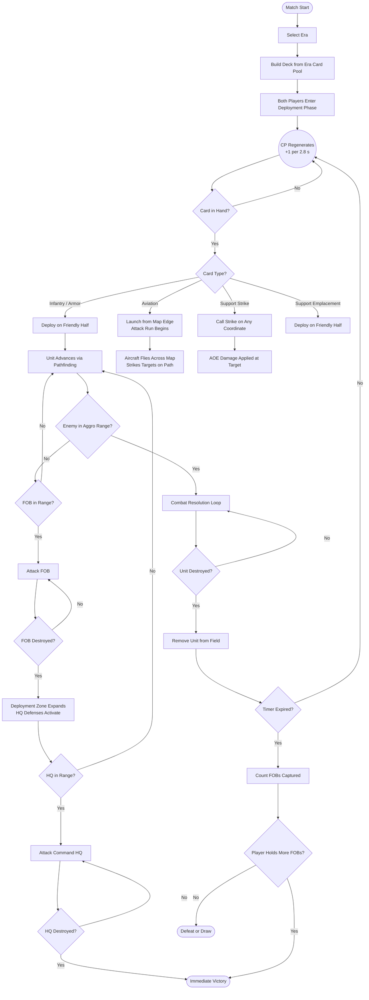

# Game Design Document: Project Iron Front

## 1. Game Overview

**Project Name:** Tank Royale
**Genre:** Real-Time Strategy (RTS) / Card Battler
**Platforms:** PC (Desktop) and Mobile, local multiplayer support
**Target Audience:** Casual and mid-core players who enjoy fast-paced PvP strategy with historical military flavor.

**Core Concept:** Players assemble a deck of cards drawn from a chosen historical era — Late WW2, Cold War, or Modern. During a fast-paced 3-minute match, players spend a regenerating resource ("Command Points") to deploy infantry squads, armored vehicles, and powerful (but costly) aircraft onto a dual-front battlefield. Units act autonomously, advancing toward the enemy's Forward Operating Bases (FOBs) and ultimately their Command HQ. The game ends with the destruction of an enemy HQ or by holding more FOBs when the timer runs out — no fantasy towers, no magic spells. Just combined-arms warfare.

---

## 2. Core Gameplay Mechanics

### The Battlefield

- **Layout:** A symmetrical top-down war map split into two halves (Friendly Half / Enemy Half) separated by a contested no-man's-land.
- **Terrain:** Roads (faster movement), open ground (standard), rubble/craters (reduced speed). Terrain is fixed per map.
- **Fronts:** Two "fronts" (left and right) cross no-man's-land, creating two distinct avenues of attack — equivalent to lanes.
- **Structures:** Each player commands 3 structures:
  - **2 Forward Operating Bases (FOBs):** One per front. They have auto-firing defensive weapons (crew-served guns, AA batteries). These are military positions, not fantasy towers.
  - **1 Command HQ:** Placed behind the FOBs. It is hardened and fully activates its perimeter defenses only after a FOB falls or takes direct fire.
- **Win Conditions:**
  - Destroying the enemy Command HQ: immediate victory.
  - Timer expiry: the player who controls (has destroyed) more enemy FOBs wins.
  - Tiebreaker: total enemy unit casualties.

### Resource System (Command Points)

- **Generation:** Command Points (CP) regenerate passively at a rate of 1 CP per 2.8 seconds.
- **Surge Phase:** In the final 60 seconds, CP generation doubles, forcing decisive action.
- **Capacity:** CP bar caps at 10. When full, generation pauses — spend CP to keep the pressure on.
- **Usage:** Deploying a card costs its listed CP value (ranging from 2 to 9).

### Eras

Players select one of three historical eras before a match. Your entire deck must be drawn from the same era's card pool. Era determines the visual style of the battlefield and the units available.

| Era          | Period       | Flavor                                                    |
| ------------ | ------------ | --------------------------------------------------------- |
| **Late WW2** | 1943–1945    | Diesel-era heavy armor, massed infantry, prop aircraft    |
| **Cold War** | 1950–1985    | Early jet CAS, MBT doctrine, helicopter gunships          |
| **Modern**   | 2000–present | Composite armor, precision munitions, multi-role aircraft |

### AI and Pathfinding

- Once deployed, units act autonomously — the player has no direct control.
- **Pathfinding:** Units calculate the shortest path to the nearest enemy objective (FOB, then HQ) along valid terrain, preferring roads.
- **Targeting Priority:** Tanks and infantry engage enemy units within their aggro radius. Aircraft fly a fixed attack-run path across the map and cannot be redirected after launch.
- **Anti-Air Awareness:** Aircraft can be targeted and shot down by units or FOBs with the **AA Capable** keyword.

---

## 3. Control Schemes

The game supports two control schemes for PC and Mobile parity.

### Touchscreen Controls (Mobile/Tablet)

- **Drag-and-Drop:** Press and hold a card in the hand, drag it over the friendly deployment zone, and release to deploy.
- **Tap-to-Deploy:** Tap a card to select it, then tap a valid tile to deploy.
- **Deselect:** Tap elsewhere or tap another card to cancel.

### Keyboard and Mouse Controls (PC)

- **Drag-and-Drop:** Left-click-hold a card, drag to the battlefield, release to deploy.
- **Hotkeys:** Keys `1`, `2`, `3`, `4` select the corresponding card in hand.
  - Selected card attaches a ghost preview to the cursor.
  - Left-click deploys; Right-click cancels.

---

## 4. Card Types and Deployment

Players bring a deck of 8 cards into battle. The hand holds 4 cards at a time. When a card is played, the next card from the deck rotation enters the hand.

### Card Types

1. **Infantry:** Squads of foot soldiers. Cheap, numerous, effective against other infantry and light vehicles. Vulnerable to tanks and artillery. Deployed on friendly ground.
2. **Armor (Tanks):** The backbone of the deck. Durable, high-damage, effective against FOBs and other vehicles. Core card type of the game. Deployed on friendly ground.
3. **Aviation:** Aircraft and helicopter gunships. Very expensive, extremely powerful, fly over terrain and engage ground targets across the entire width of the map. Cannot be deployed on the ground — they enter from the map edge and execute a single attack run before exiting. Can be shot down by AA-capable units mid-run.
4. **Support:** Limited-use deployable assets — artillery strikes, smoke screens, supply drops, defensive emplacements. Deployed on the friendly half (emplacements) or called anywhere (strikes).

### Deployment Rules

- Infantry and Armor deploy on the player's half only.
- Destroying an enemy FOB expands the valid deployment zone into the enemy's corresponding front.
- Aviation cards launch from the player's edge and fly the full map length; they cannot be dropped at a specific point.
- Support Strikes can be called on any map coordinate; Support Emplacements deploy on the friendly half only.

---

## 5. Damage Calculation System

All combat values use the following formulae. The core addition over a generic system is the **Armor / Penetration** mechanic, which creates rock-paper-scissors dynamics between unit classes.

### Core Stats

| Stat  | Description                                 |
| ----- | ------------------------------------------- |
| `HP`  | Hit Points                                  |
| `ATK` | Base damage per shot/attack                 |
| `ARM` | Armor rating — resistance to kinetic damage |
| `PEN` | Penetration — ability to defeat armor       |
| `SPD` | Attack speed (shots per second)             |
| `MOV` | Movement speed (tiles per second)           |
| `RNG` | Attack range (tiles)                        |

---

### 5.1 Armor Penetration — Core Damage Formula

When a unit fires, its shell's penetration is compared to the target's armor. Full damage is dealt only on a clean penetration.

```
Pen_Ratio = PEN_attacker / ARM_target

If Pen_Ratio >= 1.0:
    Effective_Damage = ATK                         -- Full penetration
Else:
    Effective_Damage = ATK × Pen_Ratio             -- Partial / ricochet
```

> Minimum Effective_Damage is always 10% of ATK regardless of Pen_Ratio — even a glancing blow does superficial damage.

```
Effective_Damage = max(ATK × 0.1, ATK × clamp(Pen_Ratio, 0.1, 1.0))
```

> Example: Tiger I (ATK 350, PEN 80) vs M26 Pershing (ARM 65).
> Pen_Ratio = 80/65 = 1.23 → Full penetration → Effective_Damage = 350.

> Example: Type 97 Chi-Ha (ATK 120, PEN 30) vs Tiger I (ARM 80).
> Pen_Ratio = 30/80 = 0.375 → Partial → Effective_Damage = 120 × 0.375 = 45.

---

### 5.2 Damage Per Second (DPS)

```
DPS = Effective_Damage × SPD
```

---

### 5.3 Time to Kill (TTK)

```
TTK = HP_target / DPS
```

Used internally by the AI threat-prioritization system. The unit with the lowest TTK against the firing unit is the preferred target.

---

### 5.4 Artillery / AOE Strike Damage

Artillery and strike cards deal HE (High Explosive) damage, which uses a reduced ARM modifier because HE damages through overpressure, not penetration.

```
HE_ARM_Factor = ARM_target × 0.35          -- HE only partially defeated by armor
HE_Pen_Ratio  = PEN_strike / HE_ARM_Factor
Effective_HE  = max(ATK × 0.3, ATK × clamp(HE_Pen_Ratio, 0.3, 1.0))
```

For **Falloff** strikes (blast radius), damage scales from full at the epicenter to 40% at the edge:

```
Falloff_Damage = Effective_HE × max(0.4, 1 − (Distance / Radius) × 0.6)
```

---

### 5.5 Aircraft Attack Run

Aircraft fire on targets along their flight path. They carry HE bombs and/or autocannon bursts.

- **Bombs:** Use §5.4 HE formula with a large Falloff radius.
- **Autocannon (e.g., A-10 GAU-8):** Uses §5.1 with a high dedicated PEN value that simulates depleted uranium rounds.

```
-- Autocannon (depleted uranium / HEAT rounds)
Autocannon_Damage = ATK × clamp(PEN_gun / ARM_target, 0.3, 1.0)
```

Aircraft can be **shot down** mid-run. If an AA-capable unit or FOB deals enough damage before the aircraft completes its run, it is destroyed and its remaining attacks are cancelled.

```
Aircraft_HP_Remaining -= AA_Damage_per_tick × Time_in_Range
If Aircraft_HP_Remaining <= 0: Attack run cancelled
```

---

### 5.6 FOB Targeting & Defense Fire

FOBs fire at the nearest enemy unit in range. FOBs have their own ARM rating (hardened position) but their defensive weapons deal HE-type damage (§5.4).

```
FOB_DPS = FOB_ATK × FOB_SPD × clamp(FOB_PEN / Target_ARM × 0.35, 0.3, 1.0)
```

---

### 5.7 Status Effects

| Effect          | ATK Modifier | MOV Modifier | Duration    | Source                         |
| --------------- | ------------ | ------------ | ----------- | ------------------------------ |
| **Suppressed**  | `× 0`        | `× 0.3`      | 4 s         | Smoke Screen, nearby explosion |
| **Burning**     | +Burn DoT    | `× 0.5`      | 6 s         | Napalm Strike, Flamethrower    |
| **Bogged Down** | —            | `× 0.4`      | Until clear | Minefield, Mud Terrain         |

```
Buffed_Effective_Damage = Effective_Damage × ATK_Modifier
```

Suppression does not deal damage but prevents the target from returning fire, making it ideal for advancing infantry or covering a tank push.

---

### 5.8 Burning / Napalm Damage-over-Time

Burn damage is applied in ticks every 0.5 s with linear decay:

```
Burn_Tick(n) = BurnBase × (1 − (n / TotalTicks) × 0.5)
```

Default: `TotalTicks = 12` (6 seconds), `BurnBase = 40`.
Total burn damage ≈ `BurnBase × TotalTicks × 0.75` = `360` per application.
Burn ignores ARM entirely (thermal damage).

---

### 5.9 Strafing Ramp (A-10 / Su-25 Autocannon)

When an aircraft with the **Strafing** keyword locks onto a column of targets, each additional target hit in the same run receives a stacking damage bonus:

```
Strafe_Damage(n) = Base_ATK × min(2.0, 1.0 + n × 0.25)
```

Where `n` = number of targets already hit in the current run. Bonus resets at the start of each deployment.

---

### 5.10 Infantry AT Weapons (Anti-Tank Keyword)

Infantry squads with the **AT** keyword carry dedicated anti-tank weapons (bazookas, RPGs, ATGMs). Their AT shot uses a separate high-PEN profile:

```
AT_Effective_Damage = AT_ATK × clamp(AT_PEN / ARM_target, 0.2, 1.0)
```

Infantry AT shots fire at a lower SPD than their normal rifle fire. Only one AT shot fires per squad engagement.

---

## 6. Game Flow

### 6.1 Match Flow



### 6.2 Combat Resolution


---

## 7. Card Roster

Players build an 8-card deck exclusively from their chosen era's card pool. All stat values are Level 1 baseline.

### Stat Key

| Column | Meaning                              |
| ------ | ------------------------------------ |
| CP     | Command Points to deploy             |
| HP     | Hit points                           |
| ATK    | Base damage per shot (kinetic or HE) |
| ARM    | Armor rating                         |
| PEN    | Penetration value                    |
| SPD    | Shots/sec                            |
| MOV    | Tiles/sec (0 = static)               |
| RNG    | Attack range in tiles                |
| Cnt    | Units deployed per card              |

---

## Era 1 — Late WW2 (1943–1945)

### Infantry

| #   | Name                  | Nation | CP  | HP  | ATK | ARM | PEN | SPD | MOV | RNG | Cnt | Keywords                                         |
| --- | --------------------- | ------ | --- | --- | --- | --- | --- | --- | --- | --- | --- | ------------------------------------------------ |
| 1   | **Rifle Squad**       | USA    | 2   | 120 | 55  | 0   | 5   | 1.2 | 2.0 | 3   | 6   | AT (AT_ATK 180, AT_PEN 45)                       |
| 2   | **Waffen Grenadiers** | GER    | 2   | 110 | 60  | 0   | 5   | 1.3 | 2.0 | 3   | 6   | AT (AT_ATK 200, AT_PEN 50)                       |
| 3   | **Guards Infantry**   | USSR   | 2   | 130 | 50  | 0   | 5   | 1.1 | 1.8 | 3   | 8   | AT (AT_ATK 160, AT_PEN 40); large squad          |
| 4   | **British Commandos** | UK     | 3   | 140 | 70  | 0   | 5   | 1.2 | 2.5 | 4   | 4   | Stealth: ignored by FOB until within RNG 2       |
| 5   | **Imperial Infantry** | JPN    | 2   | 100 | 55  | 0   | 5   | 1.3 | 2.2 | 2   | 8   | Banzai: first engagement ATK × 1.5; no AT weapon |

### Armor

| #   | Name                      | Nation | CP  | HP   | ATK | ARM | PEN | SPD | MOV | RNG | Keywords                                   |
| --- | ------------------------- | ------ | --- | ---- | --- | --- | --- | --- | --- | --- | ------------------------------------------ |
| 6   | **M4 Sherman**            | USA    | 4   | 1400 | 220 | 40  | 60  | 0.8 | 1.6 | 5   | —                                          |
| 7   | **M26 Pershing**          | USA    | 6   | 2000 | 340 | 65  | 90  | 0.7 | 1.3 | 5   | Heavy; counters Tiger I effectively        |
| 8   | **M18 Hellcat**           | USA    | 4   | 900  | 260 | 20  | 80  | 1.0 | 2.8 | 6   | Fast Flanker: MOV 2.8, high PEN vs low ARM |
| 9   | **Tiger I**               | GER    | 6   | 2400 | 350 | 80  | 80  | 0.6 | 1.2 | 6   | Heavy; strong frontal ARM                  |
| 10  | **Tiger II (King Tiger)** | GER    | 8   | 3000 | 400 | 100 | 90  | 0.5 | 1.0 | 6   | Very Heavy; nearly immune to most WW2 AP   |
| 11  | **Panther Ausf. G**       | GER    | 5   | 1900 | 310 | 70  | 85  | 0.7 | 1.5 | 6   | Balanced; high PEN for era                 |
| 12  | **Panzer IV Ausf. H**     | GER    | 4   | 1500 | 240 | 45  | 65  | 0.8 | 1.5 | 5   | Workhorse; cost-efficient                  |
| 13  | **T-34-85**               | USSR   | 4   | 1600 | 280 | 50  | 75  | 0.8 | 1.7 | 5   | Versatile; cheap for stats                 |
| 14  | **IS-2**                  | USSR   | 6   | 2600 | 440 | 75  | 85  | 0.4 | 1.1 | 6   | Slow fire rate; devastating single shot    |
| 15  | **KV-1S**                 | USSR   | 5   | 2200 | 260 | 65  | 60  | 0.7 | 1.3 | 5   | Durable brawler; lower PEN                 |
| 16  | **Churchill Mk VII**      | UK     | 5   | 2600 | 230 | 80  | 55  | 0.7 | 1.0 | 4   | Extreme HP and ARM; slow, low PEN          |
| 17  | **Cromwell Mk IV**        | UK     | 4   | 1300 | 230 | 38  | 65  | 0.9 | 2.0 | 5   | Fast medium tank                           |
| 18  | **Type 97 Chi-Ha**        | JPN    | 3   | 900  | 120 | 25  | 30  | 0.9 | 1.6 | 4   | Budget tank; poor penetration              |
| 19  | **Type 3 Chi-Nu**         | JPN    | 4   | 1200 | 200 | 30  | 55  | 0.8 | 1.5 | 5   | Improved gun vs Allied mediums             |
| 20  | **Carro Armato P40**      | ITA    | 3   | 1100 | 190 | 35  | 50  | 0.8 | 1.5 | 5   | Budget medium; underdog faction            |

### Aviation

| #   | Name                      | Nation | CP  | HP  | ATK | PEN | RNG | Keywords                                                      |
| --- | ------------------------- | ------ | --- | --- | --- | --- | --- | ------------------------------------------------------------- |
| 21  | **P-47D Thunderbolt**     | USA    | 6   | 600 | 280 | 50  | 4   | Strafing (§5.9); Bomb x2 (HE ATK 320, Radius 2.0); AA Capable |
| 22  | **P-51D Mustang**         | USA    | 5   | 500 | 240 | 40  | 4   | Strafing; fast attack run; weaker bombs than P-47             |
| 23  | **Fw 190A-8**             | GER    | 5   | 520 | 250 | 45  | 4   | Strafing; Bomb x1 (HE ATK 360, Radius 1.5)                    |
| 24  | **Ju 87G Stuka**          | GER    | 6   | 400 | 320 | 90  | 4   | Tank Buster: autocannon vs armor; high PEN; slow, lower HP    |
| 25  | **Il-2 Sturmovik**        | USSR   | 6   | 700 | 300 | 55  | 4   | Strafing; Bomb x2; armored airframe (harder to shoot down)    |
| 26  | **de Havilland Mosquito** | UK     | 5   | 480 | 220 | 40  | 5   | Rockets x4 (HE ATK 180, Radius 1.5); long RNG                 |

---

## Era 2 — Cold War (1950–1985)

### Infantry

| #   | Name                             | Nation | CP  | HP  | ATK | ARM | PEN | SPD | MOV | RNG | Cnt | Keywords                                                                   |
| --- | -------------------------------- | ------ | --- | --- | --- | --- | --- | --- | --- | --- | --- | -------------------------------------------------------------------------- |
| 27  | **US Airborne**                  | USA    | 3   | 150 | 70  | 0   | 5   | 1.2 | 2.2 | 4   | 5   | AT (AT_ATK 300, AT_PEN 120, RPG); can deploy on enemy half after FOB falls |
| 28  | **Soviet Motor Rifles**          | USSR   | 2   | 130 | 60  | 0   | 5   | 1.2 | 2.0 | 3   | 7   | AT (AT_ATK 280, AT_PEN 110, RPG)                                           |
| 29  | **IDF Paratroopers**             | ISR    | 3   | 160 | 75  | 0   | 5   | 1.1 | 2.4 | 4   | 4   | AT (AT_ATK 320, AT_PEN 130, ATGM); highest AT per squad                    |
| 30  | **West German Panzergrenadiers** | GER    | 3   | 145 | 65  | 0   | 5   | 1.2 | 2.1 | 4   | 5   | AT (AT_ATK 290, AT_PEN 115, Milan ATGM)                                    |
| 31  | **French Foreign Legion**        | FRA    | 3   | 155 | 72  | 0   | 5   | 1.1 | 2.2 | 4   | 4   | AT (AT_ATK 300, AT_PEN 120); Elite: morale immune to Suppression           |

### Armor

| #   | Name               | Nation | CP  | HP   | ATK | ARM | PEN | SPD | MOV | RNG | Keywords                                           |
| --- | ------------------ | ------ | --- | ---- | --- | --- | --- | --- | --- | --- | -------------------------------------------------- |
| 32  | **M48A5 Patton**   | USA    | 4   | 1800 | 280 | 55  | 100 | 0.8 | 1.5 | 6   | —                                                  |
| 33  | **M60A3 Patton**   | USA    | 5   | 2200 | 340 | 65  | 115 | 0.8 | 1.4 | 6   | Fire control: +10% effective PEN vs moving targets |
| 34  | **T-54A**          | USSR   | 4   | 1900 | 290 | 60  | 105 | 0.9 | 1.6 | 5   | Low profile: ARM counts as +10 vs RNG > 4 attacks  |
| 35  | **T-72A**          | USSR   | 5   | 2400 | 360 | 80  | 120 | 0.8 | 1.5 | 6   | ERA Option: first hit reduced by 30% (one-time)    |
| 36  | **Leopard 1A4**    | GER    | 4   | 1700 | 300 | 50  | 110 | 0.9 | 1.8 | 6   | High mobility; trades ARM for speed                |
| 37  | **Leopard 2A1**    | GER    | 6   | 2600 | 400 | 90  | 135 | 0.8 | 1.6 | 6   | Top-tier Cold War; balanced across all stats       |
| 38  | **Merkava Mk I**   | ISR    | 6   | 2800 | 380 | 85  | 125 | 0.7 | 1.3 | 6   | Crew Protect: spawns 2 Infantry on destruction     |
| 39  | **AMX-30B2**       | FRA    | 4   | 1800 | 295 | 45  | 100 | 0.9 | 1.6 | 5   | HEAT-FS: PEN vs ERA treated as full penetration    |
| 40  | **Chieftain Mk 5** | UK     | 5   | 2600 | 360 | 85  | 110 | 0.6 | 1.2 | 6   | High ARM; slow; excellent at holding position      |
| 41  | **Type 59**        | CHN    | 3   | 1600 | 250 | 50  | 90  | 0.9 | 1.5 | 5   | Budget Cold War tank                               |
| 42  | **Type 61**        | JPN    | 4   | 1800 | 280 | 55  | 100 | 0.8 | 1.5 | 5   | Standard medium; reliable                          |

### Aviation

| #   | Name                     | Nation | CP  | HP  | ATK | PEN | RNG | Keywords                                                                                 |
| --- | ------------------------ | ------ | --- | --- | --- | --- | --- | ---------------------------------------------------------------------------------------- |
| 43  | **A-10A Thunderbolt II** | USA    | 7   | 800 | 380 | 160 | 5   | Strafing (§5.9, GAU-8 autocannon); Maverick Missile x2 (HE ATK 500); high HP; AA Capable |
| 44  | **Su-25K Frogfoot**      | USSR   | 7   | 750 | 360 | 150 | 5   | Strafing; Kh-25 Rocket x4 (HE ATK 320, Radius 2.0); armored                              |
| 45  | **UH-1 "Huey" Gunship**  | USA    | 5   | 550 | 200 | 60  | 4   | Helicopter: hovers over target, attacks for 4 s before exiting; Rockets + minigun        |
| 46  | **Mi-24 Hind**           | USSR   | 6   | 700 | 280 | 80  | 5   | Helicopter; can transport 1 Infantry squad (deployed on exit); Rockets                   |
| 47  | **F-4E Phantom II**      | USA    | 6   | 600 | 300 | 70  | 5   | Bomb x4 (HE ATK 280, Radius 2.5, Falloff); air superiority vs enemy aircraft             |
| 48  | **MiG-21bis**            | USSR   | 5   | 500 | 260 | 60  | 5   | Fast run; Rocket pods x2 (HE ATK 260, Radius 1.5)                                        |

---

## Era 3 — Modern (2000–Present)

### Infantry

| #   | Name                               | Nation | CP  | HP  | ATK | ARM | PEN | SPD | MOV | RNG | Cnt | Keywords                                                               |
| --- | ---------------------------------- | ------ | --- | --- | --- | --- | --- | --- | --- | --- | --- | ---------------------------------------------------------------------- |
| 49  | **US Army Rangers**                | USA    | 3   | 180 | 80  | 2   | 5   | 1.2 | 2.4 | 5   | 5   | AT (AT_ATK 450, AT_PEN 250, Javelin ATGM); fire-and-forget AT          |
| 50  | **Russian Spetsnaz**               | RUS    | 4   | 200 | 90  | 2   | 5   | 1.1 | 2.2 | 5   | 4   | AT (AT_ATK 420, AT_PEN 230, RPG-29); Stealth: not targeted until RNG 3 |
| 51  | **IDF Golani Brigade**             | ISR    | 3   | 175 | 82  | 2   | 5   | 1.2 | 2.3 | 5   | 5   | AT (AT_ATK 460, AT_PEN 260, Spike ATGM); top AT damage                 |
| 52  | **French Foreign Legion (Modern)** | FRA    | 3   | 170 | 78  | 2   | 5   | 1.2 | 2.3 | 5   | 4   | AT (AT_ATK 400, AT_PEN 220, Milan ER); Elite                           |

### Armor

| #   | Name                   | Nation | CP  | HP   | ATK | ARM | PEN | SPD | MOV | RNG | Keywords                                                                     |
| --- | ---------------------- | ------ | --- | ---- | --- | --- | --- | --- | --- | --- | ---------------------------------------------------------------------------- |
| 53  | **M1A2 SEP v3 Abrams** | USA    | 7   | 3600 | 500 | 120 | 160 | 0.8 | 1.5 | 7   | DU Armor: ARM effectively 150 vs kinetic; APS (one ATGM intercept)           |
| 54  | **T-90M Proryv**       | RUS    | 6   | 3200 | 460 | 110 | 155 | 0.9 | 1.6 | 7   | ERA Tier 3: two AT intercepts; Shtora IR jammer (AT_PEN –20% vs this target) |
| 55  | **T-14 Armata**        | RUS    | 8   | 4000 | 520 | 130 | 165 | 0.8 | 1.5 | 7   | Unmanned Turret: ARM vs ATK is 10% higher; APS                               |
| 56  | **Leopard 2A7**        | GER    | 7   | 3400 | 490 | 120 | 160 | 0.8 | 1.5 | 7   | Urban Kit: +ARM 20 within RNG 2; top NATO all-rounder                        |
| 57  | **Merkava Mk IV**      | ISR    | 7   | 3800 | 480 | 115 | 155 | 0.7 | 1.4 | 7   | Trophy APS: intercepts first 2 ATGM attacks; Crew Protect                    |
| 58  | **Challenger 2 TES**   | UK     | 7   | 4000 | 460 | 130 | 145 | 0.6 | 1.2 | 7   | Chobham Ultra: highest ARM in era; lower PEN                                 |
| 59  | **Leclerc XLR**        | FRA    | 6   | 3200 | 470 | 110 | 155 | 0.9 | 1.7 | 7   | Autoloader: SPD 0.9 (highest for Modern MBT)                                 |
| 60  | **Type 10**            | JPN    | 6   | 3000 | 450 | 105 | 155 | 0.9 | 1.8 | 7   | Lightweight: MOV 1.8 (fastest Modern MBT)                                    |
| 61  | **K2 Black Panther**   | KOR    | 7   | 3400 | 480 | 115 | 160 | 0.8 | 1.6 | 7   | Auto-target: fires on highest-ARM enemy in range first                       |
| 62  | **Type 99A**           | CHN    | 6   | 3100 | 460 | 108 | 152 | 0.8 | 1.5 | 7   | Budget top-tier; well-rounded                                                |

### Aviation

| #   | Name                               | Nation | CP  | HP  | ATK | PEN | RNG | Keywords                                                                                                                  |
| --- | ---------------------------------- | ------ | --- | --- | --- | --- | --- | ------------------------------------------------------------------------------------------------------------------------- |
| 63  | **A-10C Thunderbolt II "Warthog"** | USA    | 8   | 900 | 500 | 220 | 6   | Strafing (§5.9, GAU-8/A DU rounds); AGM-65 Maverick x2 (HE ATK 700, Radius 2.5); best dedicated ground attack; AA Capable |
| 64  | **AH-64E Apache Guardian**         | USA    | 7   | 800 | 420 | 180 | 6   | Helicopter; hovers 5 s; Hellfire x4 (HE ATK 580, locks to highest HP target); Strafing (30mm)                             |
| 65  | **Su-25SM Frogfoot**               | RUS    | 7   | 850 | 440 | 190 | 5   | Strafing; Kh-29 Missile x2 (HE ATK 650, Radius 2.5); armored                                                              |
| 66  | **Su-57 Felon**                    | RUS    | 9   | 700 | 480 | 200 | 7   | Stealth: FOB AA does not fire until aircraft is within RNG 3; high ATK; can engage other aircraft                         |
| 67  | **F-35A Lightning II**             | USA    | 9   | 650 | 460 | 190 | 7   | Stealth: same as Su-57; GBU-53 SDB x4 (precision HE ATK 400, Radius 1.5, no Falloff)                                      |
| 68  | **F-16I Sufa**                     | ISR    | 7   | 700 | 430 | 170 | 6   | Bomb x4 (HE ATK 380, Radius 2.0); Maverick x1; versatile attack package                                                   |
| 69  | **Eurofighter Typhoon**            | GER/UK | 8   | 720 | 450 | 185 | 7   | Brimstone x6 (autonomous target-seeking; each missile hits the nearest tank for HE ATK 320)                               |

---

### Support Cards (Cross-Era)

Support cards are usable in any era. They do not count against the troop/armor/aviation composition but occupy one of the 8 deck slots.

#### Artillery Strikes

| #   | Name                    | CP  | ATK (HE)       | Radius | Duration | Notes                                                                                            |
| --- | ----------------------- | --- | -------------- | ------ | -------- | ------------------------------------------------------------------------------------------------ |
| 70  | **Artillery Barrage**   | 5   | 380            | 3.0    | Instant  | Falloff; 3-round salvo with 0.8 s between impacts                                                |
| 71  | **Rocket Salvo (MLRS)** | 6   | 280            | 2.0    | Instant  | 6 rockets land in a line; good vs columns of units                                               |
| 72  | **Napalm Strike**       | 4   | 120            | 2.5    | 6 s Burn | Applies Burning (§5.7, §5.8) to all units in zone                                                |
| 73  | **Smoke Screen**        | 2   | 0              | 3.0    | 8 s      | Applies Suppressed (§5.7) to all enemy units in cloud                                            |
| 74  | **Supply Drop**         | 3   | −400 HP (heal) | 2.5    | Instant  | Heals all friendly units in radius; cannot over-heal                                             |
| 75  | **EMP Pulse**           | 4   | 0              | 2.5    | 3 s      | Cold War / Modern: stuns all vehicles (ARM-equipped units) in area; MOV and SPD × 0 for duration |

#### Deployable Emplacements

| #   | Name                           | CP  | HP   | ATK | ARM | PEN | SPD | RNG | Lifetime | Notes                                                                                         |
| --- | ------------------------------ | --- | ---- | --- | --- | --- | --- | --- | -------- | --------------------------------------------------------------------------------------------- |
| 76  | **Anti-Tank Gun (AT Gun)**     | 3   | 600  | 320 | 10  | 110 | 0.7 | 6   | 30 s     | Targets Armor only; stationary; crew-served                                                   |
| 77  | **Anti-Aircraft Battery (AA)** | 4   | 700  | 260 | 10  | 80  | 1.2 | 7   | 35 s     | Targets Aviation only; essential counter to air                                               |
| 78  | **Bunker**                     | 4   | 1000 | 80  | 20  | 20  | 1.0 | 4   | 40 s     | Spawns 3 Infantry every 10 s; tanky structure                                                 |
| 79  | **Minefield**                  | 2   | —    | 200 | —   | 50  | —   | —   | 60 s     | Placed tile; deals HE damage and applies Bogged Down on contact; single-use per tile          |
| 80  | **Fuel Depot**                 | 3   | 500  | —   | 5   | —   | —   | —   | 50 s     | Friendly units within 3 tiles get MOV +0.4; explodes for 300 HE AOE (Radius 2.5) if destroyed |

---

## 8. User Interface (UI)

- **Top of Screen:** Enemy FOB health bars, enemy HQ health bar, match timer, enemy era/nation banner.
- **Middle:** The battlefield — isometric top-down war map with terrain features.
- **Bottom of Screen:**
  - **CP Bar:** Horizontal fill bar showing current Command Points (0–10).
  - **Current Hand:** 4 cards showing their CP cost, unit type icon, and era/nation flag.
  - **Next Card:** Small preview showing the upcoming card in deck rotation.
- **Kill Feed:** A scrolling side panel showing recent unit destructions (e.g., "Tiger II destroyed M26 Pershing").

---

## 9. Art & Audio Direction

- **Visual Style:** Stylized but grounded 3D. Realistic silhouettes for vehicles and infantry so players can identify units instantly. Not hyper-realistic — slightly saturated colors for clarity.
- **Era Visual Language:**
  - Late WW2: muted greens/browns, muddy terrain, overcast lighting.
  - Cold War: flat Eastern European plains, forest edges, grey tones.
  - Modern: desert, urban rubble, high-contrast daytime lighting.
- **Camera:** Fixed isometric/top-down perspective.
- **Audio:**
  - Distinct audio per unit type: tank engine growl on deployment, aircraft engine roar on attack run, infantry boot crunch and shouting.
  - Era-appropriate sound design (WW2 bolt-actions vs Modern carbines; WWII radial engines vs Modern turbines).
  - Warning sirens when a FOB is below 25% HP.
  - CP-full audio cue (radio burst: "Command Post at capacity").
